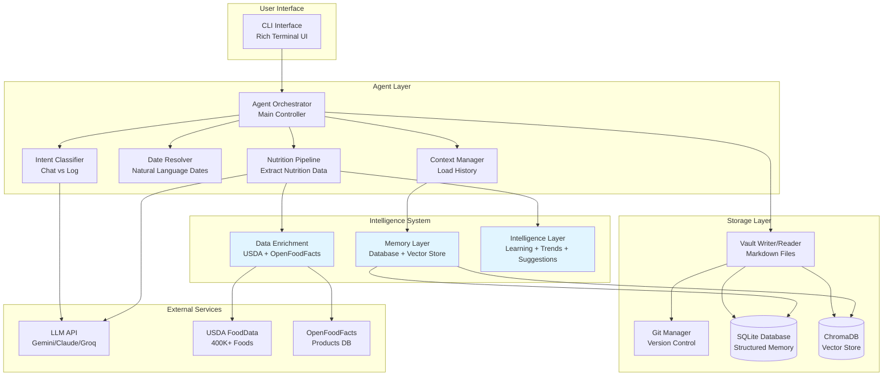
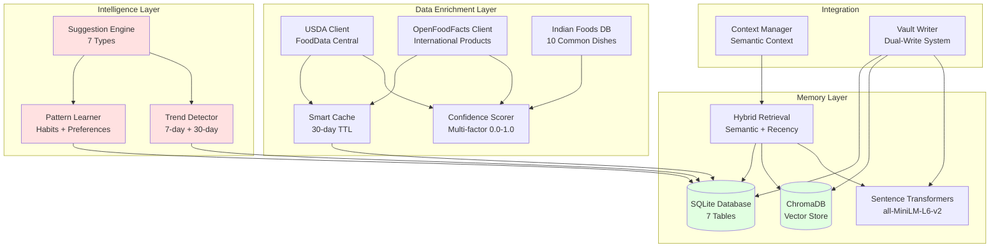
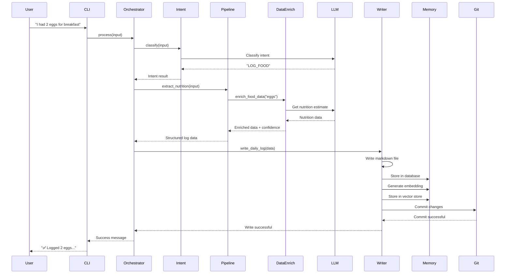
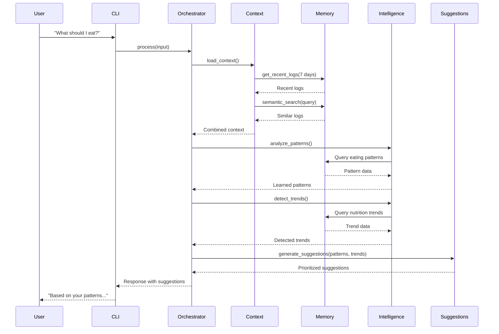
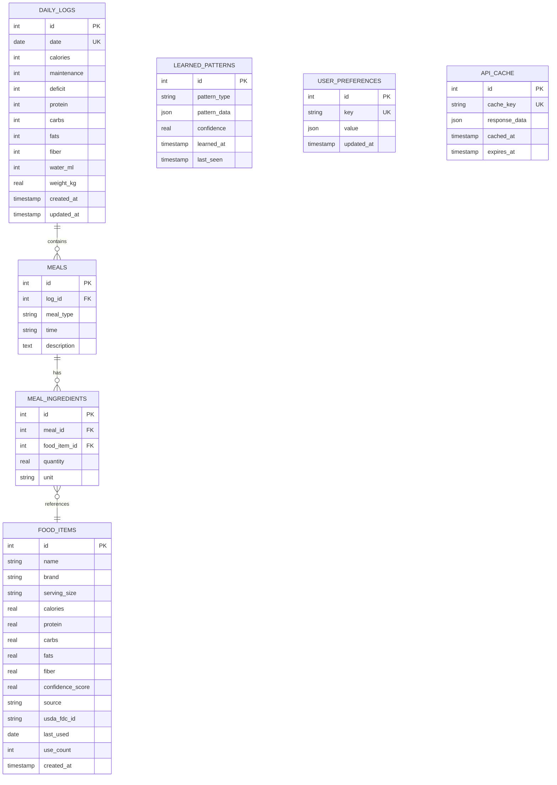

# UNAGI Architecture Diagrams

This document contains all architecture diagrams for the UNAGI project using Mermaid syntax. GitHub will automatically render these as images.

---

## 1. Overall System Architecture



---

## 2. Intelligence System Architecture



---

## 3. Data Flow - Food Logging



---

## 4. Data Flow - Intelligence & Suggestions



---

## 5. Database Schema



---

## 6. Component Dependencies

```mermaid
graph LR
    subgraph "Core"
        Config[Config/Settings]
        Container[DI Container]
    end
    
    subgraph "Agent"
        Orchestrator[Orchestrator]
        Intent[Intent Classifier]
        DateResolver[Date Resolver]
        Context[Context Manager]
        Pipeline[Nutrition Pipeline]
    end
    
    subgraph "Intelligence"
        Memory[Memory Layer]
        DataEnrich[Data Enrichment]
        Intelligence[Intelligence Layer]
    end
    
    subgraph "Storage"
        Vault[Vault Reader/Writer]
        Git[Git Manager]
    end
    
    subgraph "UI"
        CLI[CLI Interface]
    end
    
    subgraph "External"
        LLM[LLM Client]
    end
    
    Container --> Config
    Container --> Orchestrator
    Container --> Memory
    Container --> Vault
    Container --> Git
    Container --> LLM
    
    Orchestrator --> Intent
    Orchestrator --> DateResolver
    Orchestrator --> Context
    Orchestrator --> Pipeline
    Orchestrator --> Vault
    Orchestrator --> Git
    
    Context --> Memory
    Context --> Vault
    
    Pipeline --> DataEnrich
    Pipeline --> Intelligence
    Pipeline --> LLM
    
    Vault --> Memory
    
    CLI --> Container
    
    style Container fill:#ffe1e1
    style Memory fill:#e1f5ff
    style Intelligence fill:#e1f5ff
```

---

## 7. Deployment Architecture

```mermaid
graph TB
    subgraph "User's Machine"
        subgraph "UNAGI Application"
            App[Python Application<br/>main.py]
            Venv[Virtual Environment<br/>Python 3.11+]
        end
        
        subgraph "Local Storage"
            Vault[Obsidian Vault<br/>Markdown Files]
            DB[(SQLite Database<br/>memory.db)]
            Vector[(ChromaDB<br/>vector_store/)]
            Git[Git Repository<br/>.git/]
        end
        
        subgraph "Obsidian"
            Obsidian[Obsidian App<br/>Vault Viewer]
        end
    end
    
    subgraph "External Services"
        LLM[LLM API<br/>Gemini/Claude]
        USDA[USDA API<br/>Optional]
        OFF[OpenFoodFacts<br/>Optional]
        GitHub[GitHub<br/>Optional Backup]
    end
    
    App --> Venv
    App --> Vault
    App --> DB
    App --> Vector
    App --> Git
    
    Obsidian --> Vault
    
    App -.->|API Calls| LLM
    App -.->|Optional| USDA
    App -.->|Optional| OFF
    Git -.->|Optional Push| GitHub
    
    style App fill:#e1f5ff
    style Vault fill:#ffe1e1
    style DB fill:#e1ffe1
    style Vector fill:#e1ffe1
```

---

## Notes

- All diagrams use Mermaid syntax and will render automatically on GitHub
- Blue boxes indicate intelligence system components
- Green boxes indicate storage components
- Red boxes indicate core application components
- Dotted lines indicate optional connections
- Solid lines indicate required connections
